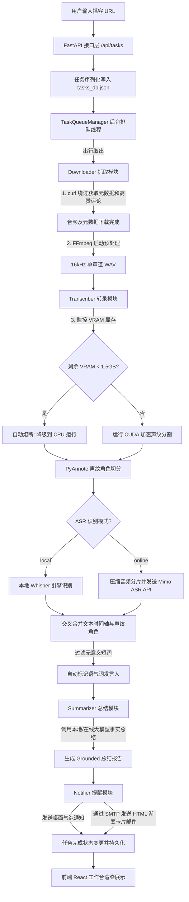

# # 🎙️ **whisperMe**

**whisperMe** 是一款专为播客爱好者与知识整理控量身打造的**本地化、私密化播客转录与 AI 知识提炼工作台**。它支持一键抓取主流播客平台（如小宇宙 FM、Bilibili、本地音频等），智能提取声纹角色，将长语音精准识别为时间轴剧本，并调用大模型（本地 LLM / 在线 API）生成深度 Grounded 的暗黑卡片风格总结，最终自动通过邮件推送至您的收件箱。

---

### 1. 项目简介与核心功能 (Project Overview & Features)

#### 💡 一句话简介
> 解决本地计算资源受限下的并发堵塞与显存崩盘，实现一键自动化、安全无幻觉的播客声纹转录与卡片式知识提炼。

#### 🌟 核心功能列表
* **📥 播客解析与高速下载**：内置专有轻量级解析引擎，配合 `curl.exe` 安全绕过 Cloudflare 校验，一键抓取并流式下载音频、Showsnotes 元数据以及高赞评论。
* **⚙️ 串行任务队列约束 (Resource Control)**：采用 FIFO 单线程排队机制。无论同时导入多少个链接，任务都会在后台严格按顺序依次运行，防止多任务并发造成系统 CPU/GPU 过载卡死。
* **🔌 动态显存安全熔断 (VRAM Safeguard)**：智能监控 GPU 剩余可用显存（安全阈值 1.5 GB）。若显存不足（例如本地正在运行 LM Studio/大模型推理），声纹分割与本地转录自动降级至 CPU 运行，杜绝 CUDA 显存溢出（OOM）崩溃及 Windows 物理页面交换带来的卡顿。
* **👤 智能声纹库与上下文改名**：
  * 提取发言人的 512 维特征向量并持久化至本地声纹库。
  * 结合 Shownotes 与对话上下文，由 AI 自动推定发言人真实姓名。
  * 手动修改昵称后自动绑定声纹库，未来相同声音自动匹配为该姓名。
* **🏷️ 语气词边缘人自动标记**：全自动扫描识别在整期播客中仅说短语或语气助词（如“嗯”、“对”、“好的”）的边缘发言人，并自动标记为“未识别语气词”。
* **📝 事实一致性与“防脑补”总结**：提炼提示词经过深度 Grounding 加固，大模型总结 100% 紧扣转录文本及真实评论事实，拒绝臆测与发散。
* **✉️ 暗黑风格卡片邮件推送**：任务完成后自动发送 HTML 暗黑卡片风格总结邮件。包含内容信息密度评级（A+ ~ D）、适合人群、核心收听建议、议题提炼及精选金句。

---

### 2. 视觉直观展示 (Showcase / Quick Demo)

提供了一个高度精美、动效丝滑的本地工作台，方便您直观查看和微调转录详情。

> 📸 **[这里插入产品主界面截图或运行动图，帮助用户直观理解]**
> ``

---

### 3. 快速上手指南 (Quick Start)

让您在 3 分钟内本地跑通 whisperMe 的全链路转录流程。

#### 💻 环境要求
* **后端 (Backend)**: Python >= 3.10, FFmpeg (已配置系统环境变量)
* **前端 (Frontend)**: Node.js >= 18, npm

#### 📥 克隆与安装

```bash
# 1. 克隆仓库
git clone https://github.com/quentin2001/whisperMe.git
cd whisperMe

# 2. 安装后端 Python 依赖
cd backend
python -m venv venv
venv\Scripts\activate  # Windows 激活虚拟环境
# source venv/bin/activate  # Linux/Mac 激活虚拟环境
pip install -r requirements.txt

# 3. 安装前端 Node 依赖
cd ../frontend
npm install
```

#### 🚀 启动项目

请确保您的本地大模型服务（如 Ollama 或 LM Studio）已正常启动，然后在不同的终端窗口中分别运行后端与前端服务：

* **启动后端 API 服务 (端口 8000)**:
  ```bash
  cd backend
  venv\Scripts\activate
  python run.py
  ```
* **启动前端 Web 工作台 (端口 5173)**:
  ```bash
  cd frontend
  npm run dev
  ```
启动后在浏览器中打开 `http://localhost:5173` 即可开始使用。

---

### 4. 配置与环境变量说明 (Configuration)

请将项目根目录下的 `config.example.json` 复制并重命名为 `config.json`，然后根据本地实际路径和参数进行配置：

| 配置项 / 变量名 | 类型 | 是否必填 | 默认值 | 作用描述 |
| :--- | :--- | :--- | :--- | :--- |
| `ffmpeg_path` | String | 是 | - | 本地 FFmpeg.exe 的物理绝对路径 |
| `ffmpeg_bin_dir` | String | 是 | - | FFmpeg bin 目录绝对路径 |
| `local_whisper_model_path` | String | 是 | - | 本地下载好的 Whisper 模型存放绝对路径 |
| `hf_token` | String | 否 | `""` | Hugging Face 授权 Token，用于自动加载 PyAnnote 声纹管道（若无则降级为纯 ASR） |
| `ollama_url` | String | 否 | `http://localhost:11434` | 本地 LLM（Ollama / LM Studio）接口根地址 |
| `ollama_model` | String | 否 | `qwen2.5:7b-instruct` | 本地总结模型代号 |
| `smtp_server` | String | 否 | `smtp.qq.com` | 发送总结邮件的 SMTP 服务器地址 |
| `smtp_port` | Number | 否 | `465` | SMTP 发送端口 |
| `smtp_username` | String | 否 | `""` | 用于发送邮件的邮箱账号 |
| `smtp_password` | String | 否 | `""` | 发送邮箱的 SMTP 客户端授权密码 |
| `smtp_sender` | String | 否 | `""` | 邮件发件人显示邮箱 |
| `notification_email` | String | 否 | `""` | 接收卡片式总结报告的电子邮箱 |
| `enable_win_notification` | Boolean | 否 | `true` | 是否启用 Windows 桌面气泡通知 |
| `asr_mode` | String | 否 | `local` | 语音转录引擎模式：`local` (本地大模型) / `online` (在线 API) |
| `online_api_key` | String | 否 | `""` | 在线 ASR API 授权 Key |
| `online_base_url` | String | 否 | `https://token-plan-sgp.xiaomimimo.com/v1` | 在线 ASR API 基准地址 |
| `online_model` | String | 否 | `mimo-v2.5-asr` | 在线 ASR 语音模型标识 |
| `summary_mode` | String | 否 | `local` | 总结报告引擎模式：`local` (本地 Ollama/LM Studio) / `online` (在线 API) |
| `online_summary_api_key` | String | 否 | `""` | 在线 LLM 总结 API 授权 Key |
| `online_summary_base_url` | String | 否 | `https://api.openai.com/v1` | 在线 LLM 总结 API 代理地址 |
| `online_summary_model` | String | 否 | `gpt-4o-mini` | 在线 LLM 总结模型标识 |

---

### 5. 核心工作流与架构设计 (Workflow & Architecture)

以下为 `whisperMe` 全链路处理流程的数据流向和生命周期图示：


