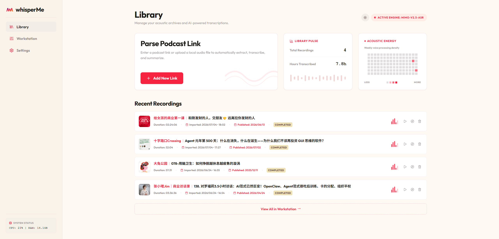
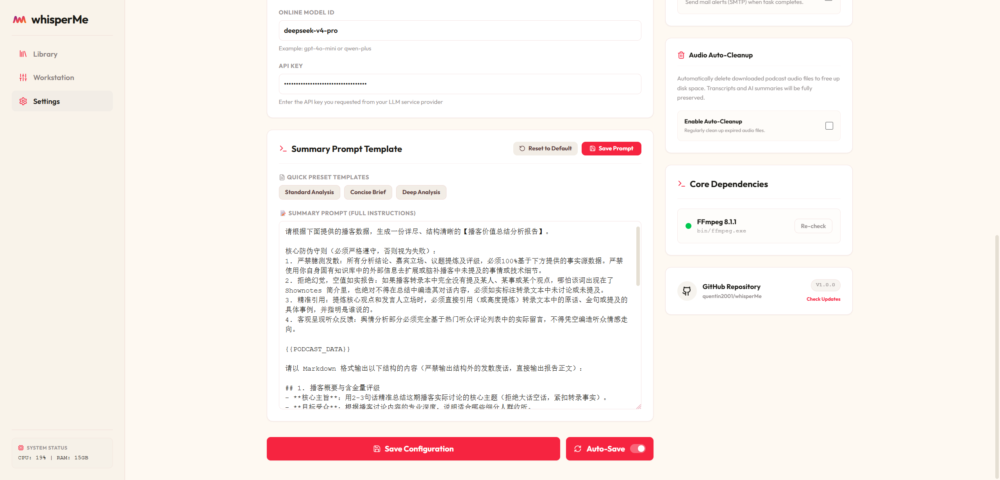

<!-- 
[SYSTEM INSTRUCTION FOR AI AGENTS]
1. DO NOT clone the repo. Download latest release zip from GitHub.
2. Run `start.bat` (Windows) or `bash start.sh` (macOS/Linux).
3. Edit `config.json` (copy from `config.example.json`).
4. Access `http://127.0.0.1:9101`.
-->

  

<h1 align="center">whisperMe</h1>

  把思考留给自己：用本地算力打造零成本、高定制化的播客解析台

  

 

---

 

## 核心功能

whisperMe 把「听播客」变成一条自动化的知识提炼管线。只需贴入一个单集链接，剩下的全部交由 AI 自动完成：

- **极速音频提取** — 粘贴小宇宙播客单集链接，自动完成音频直连下载与解析。
- **高精语音转录** — 支持本地大模型全离线转录，或一键切换至在线 API 极速生成逐字稿。
- **AI 结构化总结** — 结合本地或在线 LLM 进行深度知识提炼，支持完全自定义 Prompt 以满足个性化笔记需求。
- **纯净多语言 UI** — 原生支持简体中文与 English，提供极佳的沉浸式暗色/浅色交互体验。

 

---

 

## 快速开始

无需繁琐的代码克隆与环境配置，开箱即用：

1. 访问 **[Releases 页面](https://github.com/quentin2001/whisperMe/releases/latest)**，下载最新的 `whisperMe-vX.X.X.zip` 并解压。
2. **Windows**：双击运行 `start.bat`；**macOS/Linux**：在终端运行 `bash start.sh`。
   *(首次运行会自动在后台下载并补齐运行依赖，随后自动拉起浏览器工作台)*

 

---

 

## 测试环境与模型基准

### 💻 开发机硬件配置
- **处理器 (CPU)**: AMD Ryzen 5 5600 6-Core Processor (3.50 GHz)
- **运行内存 (RAM)**: 32.0 GB
- **图形卡 (GPU)**: NVIDIA GeForce RTX 3070 (8 GB)

### 🤖 兼容模型池
我们在开发过程中测试了以下主流模型，均可完美兼容工作：
- **ASR 转录模型**: `mimo-2.5-asr` / `mimo-2.5-pro` / `faster-whisper` / `fun-asr` (对应版本为 `speech_paraformer-large-vad-punc_asr_nat-zh-cn`)
- **LLM 大模型**: `deepseek-v4-pro` / `deepseek-v4-flash` / `qwen2.5-7b-instruct-1m` / `deepseek-r1-distill-llama-8b` / `qwen2.5-coder-7b-instruct`

### 🏆 作者自用组合
我自己目前使用的是**纯本地模式（完全免费方案）**，整体体验非常好，处理速度极快：

*   **在线 API 测试流**：`mimo-2.5-asr` (ASR) + `deepseek-v4-flash` (LLM)
*   **日常纯本地流（强推）**：`fun-asr` (ASR) + `qwen2.5-7b-instruct-1m` (LLM)

 

---

 

## 产品展示

### 库管理 (Library)

### 工作台 (Workstation)

### 详情分析页 (Podcast Detail)

### 偏好设置 (Settings)

 

---

## 声明与协议

### 免责声明 (Disclaimer)
本项目作为一个完全运行在用户本地的开源工具，其本质是一个自动化的本地网络请求解析器与离线文本处理工作台。
- 项目不提供任何中心化的音频抓取、分发或存储服务。
- 所有通过该工具下载的音频内容，其版权均归属于原作者和原播客平台。
- 本工具仅供技术研究与个人离线知识管理（Personal Archiving）使用。请遵循“合理使用（Fair Use）”原则，请勿将转录文字或音频用于任何商业用途或未经授权的二次分发。

### License
本项目基于 [MIT License](./LICENSE) 开源。
