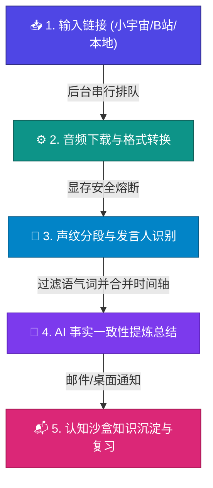

<p align="center">
  
</p>

<h1 align="center">whisperMe</h1>

<p align="center">
  <strong>私密、高效的本地化/云端混合式播客转录与 AI 知识提炼工作台</strong>
</p>

---

### 🌟 核心功能 (Core Features)

* **📥 极速下载与解析**：支持小宇宙 FM、Bilibili 解析下载，智能分离音视频并流式输出 MP3。
* **🔄 混合转录引擎 (ASR)**：支持本地离线 Whisper 与云端高精 API（如小米 MiMo ASR），支持按需灵活搭配。
* **👤 智能声纹识别**：基于 PyAnnote 提取声纹特征并持久化。结合 Shownotes 自动推断发言人姓名。
* **🛡️ 显存熔断与排队**：后台 FIFO 单线程排队，监控显存状况（阈值 1.5 GB），不足时声纹分割与本地识别自动降级至 CPU 运行，杜绝显存溢出 (OOM)。
* **🧠 认知沙盒 (Sandbox)**：一键段落沉淀、Anki 卡片自动生成、艾宾浩斯记忆算法（SuperMemo-2）老虎机复习、SVG 知识网络可视化与 AI 跨界碰撞。

---

### 🧭 工作流程 (Workflow)



---

### 🚀 快速上手 (Quick Start)

#### 📋 环境要求
- **OS**: Windows 10/11 (支持 CUDA 硬件加速), macOS (CPU/MPS 模式)
- **依赖**: Python >= 3.10, Node.js >= 18, FFmpeg

#### 📥 安装与运行
```bash
# 1. 克隆并安装后端依赖
git clone https://github.com/quentin2001/whisperMe.git
cd whisperMe/backend
python -m venv venv
venv\Scripts\activate  # Windows
# source venv/bin/activate  # macOS/Linux
pip install -r requirements.txt
python run.py  # 启动后端 API (Port 8000)

# 2. 安装并运行前端
cd ../frontend
npm install
npm run dev   # 启动前端 Web (Port 5173)
```

---

### ⚙️ 核心配置说明 (Configuration)

复制根目录下 `config.example.json` 为 `config.json` 并配置以下关键项：

- `ffmpeg_path`: 本地 FFmpeg.exe 绝对物理路径。
- `local_whisper_model_path`: 本地 Whisper 模型绝对物理路径。
- `hf_token`: Hugging Face 令牌（用于加载 PyAnnote 声纹分轨，留空则降级为纯转录）。
- `ollama_url` / `ollama_model`: 本地 LLM（如 Ollama）地址与模型代号。
- `asr_mode` / `summary_mode`: ASR 与总结模式，支持 `local` (离线大模型) 或 `online` (在线 API)。
- `smtp_username` / `smtp_password`: 用于发送总结报告邮件的 SMTP 配置。
