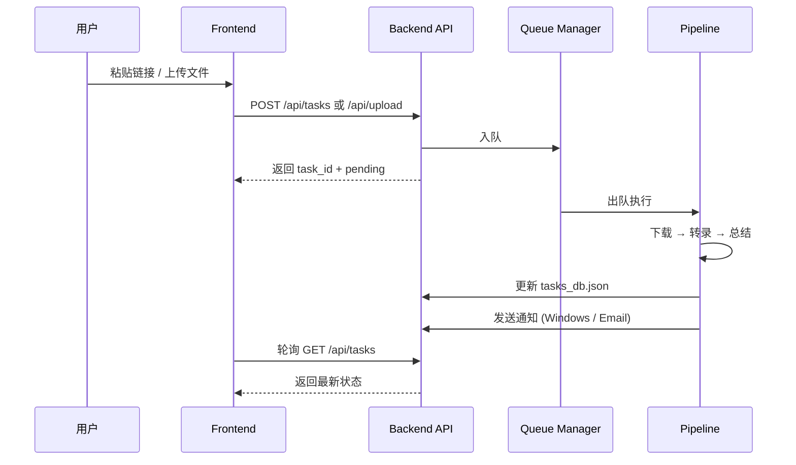
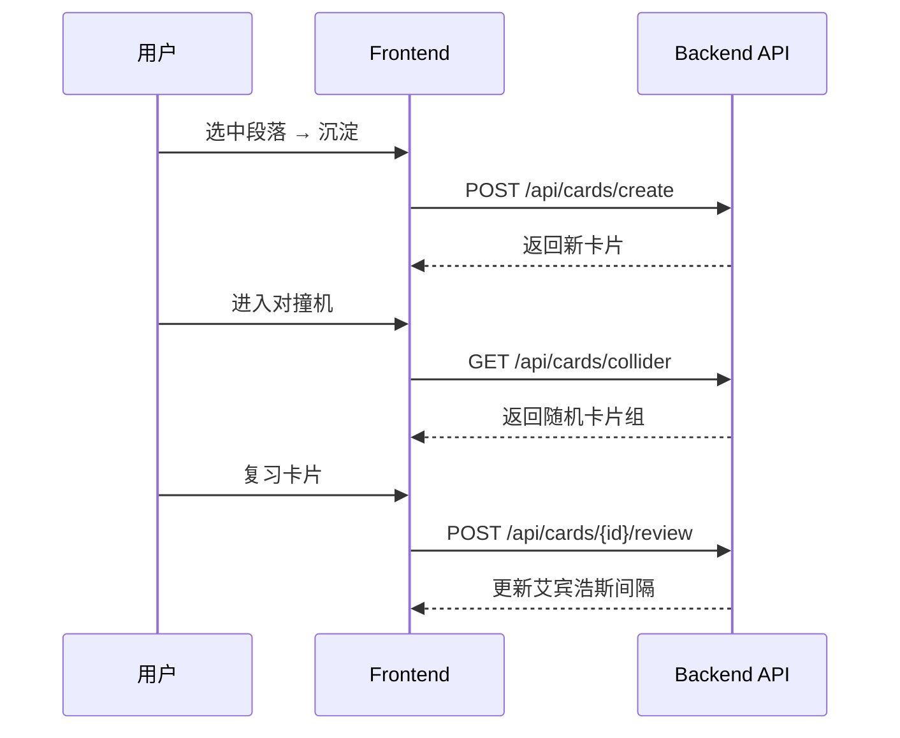

# whisperMe — 系统架构设计文档

> 最后更新：2026-06-24 · Session `2026-06-24`

---

## 1. 总体架构

whisperMe 采用经典的前后端分离 **SPA + REST API** 架构，部署于本地桌面环境（Windows）。

```mermaid
graph TB
    subgraph Frontend ["🖥️ Frontend (Vite + React)"]
        A[App.jsx — SPA 路由与全局状态]
        A2[contexts/ThemeContext — 暗色模式管理]
        B[views/ — 页面级业务视图]
        C[components/ — 侧边栏与表单件]
        D[index.css — CSS 变量 / 暗色主题 / 滚动条]
    end

    subgraph Backend ["⚙️ Backend (FastAPI + Uvicorn)"]
        E[main.py — App 挂载与分发外壳]
        F[config.py — 全局配置与 BaseModel 校验]
        G[database.py — SQLite 并发 WAL 数据库]
        H[routers/ — 路由层 tasks/config/system/boards]
        I[core/pipeline.py — 流水线调度核心]
        J[core/speaker.py — 声纹匹配与智能推理]
        K[core/transcriber.py — ASR 识别引擎 (常驻 VRAM 缓存)]
        L[core/downloader.py — 音频下载器]
        M[core/summarizer.py — LLM 总结器]
        N[core/queue_manager.py — SQLite 任务队列管理器]
    end

    subgraph Storage ["💾 本地存储"]
        O[config.json — 全局配置文件]
        P[whisperMe.db — SQLite 数据库（含 speakers 声纹表）]
        R[prompt.json — AI 总结 Prompt 模板]
        S[downloads/ — 原始音频文件]
    end

    A -->|HTTP REST| H
    H --> G
    H --> N
    N --> G
    N --> I
    I --> G
    I --> L
    I --> K
    I --> M
    I --> J
```

---

## 2. 目录结构

```
whisperMe/
├── README.md                  # 项目首页说明
├── config.json                # 运行时全局配置（由 config.example.json 复制）
├── config.example.json        # 配置模板
├── prompt.json                # AI 总结 Prompt 模板
├── logo.svg                   # 品牌 Logo
├── speaker_fingerprints.json  # 声纹指纹存储
├── whisperMe.db               # SQLite 关系数据库（主数据源，默认位于 STORAGE_BASE）
├── tasks_db.json.bak          # 自动迁移后的 JSON 备份文件
├── start_project.py           # 一键启动并记录日志的后台管理脚本
├── 一键启动.bat                # Windows 环境双击一键启动入口
├── logs/                      # 前后端标准流重定向持久化日志
│
├── backend/
│   ├── run.py                 # 后端入口（uvicorn 启动器）
│   ├── requirements.txt       # Python 依赖清单
│   └── app/
│       ├── __init__.py
│       ├── config.py          # 全局配置 BaseModel 校验
│       ├── database.py        # SQLite 数据库控制层 (WAL 并发模式)
│       ├── main.py            # FastAPI App 挂载与分发外壳
│       ├── prompt.json        # 内部 Prompt 备份
│       ├── routers/           # 模块化路由层
│       │   ├── __init__.py
│       │   ├── tasks.py       # 任务管理 API
│       │   ├── config.py      # 系统设置 API
│       │   ├── system.py      # 系统状态 & 性能 API
│       │   └── boards.py      # 知识卡片 & 看板 API
│       └── core/
│           ├── downloader.py      # 小宇宙 / Bilibili 下载器
│           ├── transcriber.py     # Whisper / MiMo ASR 转录引擎 (VRAM 缓存)
│           ├── summarizer.py      # Ollama / 在线 LLM 总结器
│           ├── notifier.py        # 邮件 & Windows 桌面通知
│           ├── queue_manager.py   # SQLite 驱动后台持久队列
│           ├── prompt_manager.py  # Prompt 模板 IO
│           ├── speaker.py         # 声纹识别与智能推理核心
│           └── pipeline.py        # 流水线作业调度核心
│
├── frontend/
│   ├── package.json
│   ├── vite.config.js
│   └── src/
│       ├── main.jsx           # React 挂载入口
│       ├── App.jsx            # SPA 容器组件，负责全局导航与状态轮询
│       ├── App.css            # 辅助样式
│       ├── index.css          # 核心 CSS / 设计令牌 / 扩展式滚动条
│       ├── components/        # 功能型局部件
│       │   ├── Sidebar.jsx    # 品牌侧边栏导航
│       │   └── Topbar.jsx     # 系统标题顶栏
│       └── views/             # 视图级业务模块
│           ├── LibraryView.jsx       # 播客库主视图，含存储量显示与录音入口
│           ├── WorkstationView.jsx   # 播客工作台网格与列表切换视图
│           ├── PodcastDetailView.jsx # 详情拖拽分析页，含三页签划分与发言人管理模态框
│           └── SettingsView.jsx      # 系统高级配置表单视图
│
├── downloads/                 # 下载的原始音频
├── transcripts/               # 转录结果 JSON
├── temp_sandbox/              # 临时沙盒目录
├── hf_cache_models/           # HuggingFace 模型缓存
├── models/                    # 本地模型文件
└── docs/                      # 项目文档
```

---

## 3. 后端核心模块

### 3.1 config.py — 全局配置与 BaseModel 校验
*   **配置校验与补齐**：升级使用 Pydantic v2 `BaseModel` 对全局配置文件 `config.json` 进行严苛的类型与默认值补齐校验，消除外部 `pydantic-settings` 依赖，杜绝缺失或非法配置导致启动崩溃。
*   **环境防御机制**：包含四层"钢铁防御"机制，专门解决 Windows 本地部署下的路径和兼容性问题：
    1.  NumPy 2.0 向后兼容性补焊（修复 `np.NaN`、`np.float`）。
    2.  重写控制台标准流 `stdout` / `stderr` 编码为标准 UTF-8，规避中文报错。
    3.  自动提取 venv 中 NVIDIA DLL (cuBLAS/cuDNN) 并动态注入 Path。
    4.  转换 TEMP/TMP/HOME 等环境变量至英文短路径沙盒（8.3 短路径转换），规避中文字符集报错。
*   **HuggingFace 动态 Patch**：根据 `hf_token` 配置自动切换官方源或 hf-mirror.com 镜像源。

### 3.2 routers/ — 模块化 API 控制器层
路由结构解耦，子接口在主模块中通过挂载 `APIRouter` 注册：
*   **tasks.py (任务管理 API)**：负责播客任务的增删改查、重新下载、物理文件清理、智能命名保存以及重生成总结等核心生命周期逻辑。新增 `POST /api/tasks/{task_id}/cancel` 中断及取消逻辑。
*   **config.py (配置设置 API)**：负责读取、修改并回写全局 `config.json`，以及 Prompt 推送词模板的读取和热修改。
*   **system.py (系统状态 API)**：负责本地硬件信息（CPU、RAM、GPU、VRAM）实时拉取，支持版本检测及性能哨兵后台调度。
*   **boards.py (看板卡片 API)**：负责知识段落、脑洞对撞机、连线链接、复习卡片、看板布局的全套 CRUD 及艾宾浩斯复习曲线算法。

### 3.3 core/ — 核心业务处理管道
后端服务分离出两大核心作业模块：
*   **pipeline.py (流水线调度核心)**：负责将播客的下载 -> 音频 Mono/16kHz 预处理 -> 声纹分割 (PyAnnote) -> 语音转录 (Whisper) -> 语义段落聚合 (Semantic Chunking) -> 声纹命名识别 -> LLM 深度总结 (Ollama/在线) -> 桌面/邮件推送这一整套作业过程组装成原子流水线，并包含实时的 `check_cancelled` 取消检查。
*   **speaker.py (声纹与大模型推理核心)**：
  - **自适应噪音过滤**：预清洗无意义的短语气助词，直接跳过大模型，降低运行成本。
  - **历史声纹 Cosine 相似度匹配**：自动比对 `speaker_fingerprints.json` 余弦相似度，秒级识别老熟人姓名。
  - **大模型简介与指征匹配**：对剩余未知 SPEAKER，通过大模型读取简介和对话上下文，做黄金交叉 Shownotes 拼写交叉验证，智能推断出本集在场发言人真实姓名。
*   **transcriber.py (ASR 转录引擎)**：
  - **在线模式零 AI 库导入**：在线 ASR 模式下，系统启动彻底延迟并规避 `torch`、`faster_whisper` 和 `pyannote` 导入，极大提升启动耗时。
  - **ModelCacheManager 单例缓存**：本地模式下，常驻缓存已加载 of `WhisperModel` 实例，大幅消除转录冷启动重新读盘时间。
  - **显存/内存自动释放 (TTL/LRU)**：支持 `local_model_idle_timeout`，模型闲置超时后自动清空 PyTorch CUDA 缓存并进行 GC。
*   **downloader.py**：多网页自适应抓取引擎，包含 httpx (有/无代理) -> curl.exe (有/无代理) 4 级自适应，保障网络穿透。
*   **summarizer.py**：双模式总结 (本地 Ollama/在线 OpenAI)，内置 Doh DNS Bypass 功能直连抗劫持。
*   **notifier.py**：邮件与 Windows 桌面通知。
*   **queue_manager.py**：SQLite 驱动的持久化 FIFO 后台任务队列，能在服务崩溃/重启后断点自动续传。

### 3.4 database.py — SQLite WAL 数据持久化 (高并发读写)
*   **线程隔离连接池**：使用 `threading.local` 为每一个后台工作线程 and Web 请求线程建立专属的 `sqlite3.Connection` 实例，从根本上隔离了连接争抢。
*   **并发 WAL (Write-Ahead Logging) 模式**：通过 PRAGMA 开启 WAL，全面支持读写并行。面板加载与卡片拉取请求时完全零锁阻塞，响应敏捷。
*   **Busy Timeout 与外键级联**：开启 `PRAGMA foreign_keys = ON;` 级联删除，设置 `PRAGMA busy_timeout = 30000;` 智能等待繁忙写入锁，并在 Python 端使用 `write_lock` 序列化写操作，规避死锁。

## 4. 前端架构

### 4.1 技术栈

- **Vite** — 构建工具
- **React 18** — UI 框架
- **Vanilla CSS** — 全局样式，使用 CSS Custom Properties (设计令牌)
- **无第三方 UI 库** — 所有组件均为自研

### 4.2 页面结构

| 页面/Tab | 功能 |
|----------|------|
| 播客库 (Dashboard) | 任务列表、状态监控、新增任务 |
| 任务详情 (Detail) | 剧本对话流、AI 总结报告、Shownotes、说话人管理 |
| 认知沙盒 (Sandbox) | 段落沉淀、Anki 闪光卡片、AI 碰撞器 |
| 系统设置 (Settings) | 外观主题、ASR/LLM 引擎配置、SMTP 通知配置 |

### 4.3 国际化 (i18n)

内置四语言支持，通过 `TRANSLATIONS` 常量对象实现前端 i18n：
- 🇨🇳 简体中文 (`zh-CN`) — 默认
- 🇹🇼 繁體中文 (`zh-TW`)
- 🇺🇸 English (`en-US`)
- 🇯🇵 日本語 (`ja-JP`)

### 4.4 主题系统

支持 **浅色 / 深色 / 跟随系统** 三种显示模式，每种模式内置多套预设配色方案（如 Antigravity Slate、Midnight Obsidian 等），并支持自定义背景色/前景色/强调色。

### 4.5 设计令牌 (Design Tokens)

所有样式通过 CSS Custom Properties 统一管理（见 `index.css :root`），包括：
- 字体：Outfit + Noto Sans SC
- 色彩：HSL 调和配色系统
- 圆角：`--radius-sm` (8px) / `--radius-md` (14px) / `--radius-lg` (24px)
- 过渡：`--transition-smooth` (cubic-bezier)

### 4.6 播放跳转与评论互动

前端实现了深度的播放跳转与多文本来源的联动机制：
- **气泡定位跳转**：点击段落对话气泡时，播放器会自动定位到该段落的起始时间（`para.start_time`），而非单个词语的随机时间。悬停气泡时，前端会呈现动态播放图标，提示可交互性。
- **评论与简介时间戳解析 (CommentRenderer)**：系统通过正则表达式（如 `((\d{1,2}):)?(\d{2}):(\d{2})`）匹配解析网友热评、节目简介中的时间格式，将其动态转换成内嵌按钮。
- **平滑滚动与金色发光反馈**：用户点击解析出的时间戳或气泡后，左侧的剧本对话流会自动使用平滑滚动（`scrollIntoView({ behavior: 'smooth' })`）将对应时段的段落移动到视口中央，并在该段落上渲染一个持续 2 秒的金色发光（`glow-highlight`）动效，引导视觉聚焦。

---

## 5. 数据流

### 5.1 新建任务流程



### 5.2 认知沙盒流程



---

## 6. 关键设计决策

| 决策 | 理由 |
|------|------|
| SQLite WAL + 线程隔离连接池 | 解决多线程读写下的 I/O 并发卡顿。通过 WAL 模式支持读写并行，去除读锁限制，提供秒级面板渲染，配合 30s `busy_timeout` 与外键级联确保数据一致性 |
| 延迟加载 (Lazy Loading) 机制 | 彻底重写 ASR 导入逻辑。在在线 ASR 模式下不载入 `torch` 等庞大依赖，实现零 AI 运行库的超轻量启动，利于 SaaS 低成本快速发布 |
| 显存常驻与 TTL 自动释放 | `ModelCacheManager` 单例缓存 WhisperModel 解决本地转录时重复加载模型的 I/O 痛点，支持超时自动释放 GPU 显存，对低配主机的多任务稳定性友好 |
| 8.3 短路径转换 | 规避 Windows 中文用户名或含有空格的路径导致的 C++ 底层库（FFmpeg/Faster-Whisper）报错 |
| HuggingFace 镜像自动切换 | 国内用户无需配置代理即可下载 PyAnnote/Embedding 模型 |
| 显存熔断降级 | GPU 内存不足时自动切换至 CPU 模式，避免 OOM 崩溃 |
| 单文件 SPA (App.jsx) | 减少组件间通信复杂度，适合快速迭代的个人项目 |
| SQLite 驱动持久化任务队列 | 将原有内存 FIFO 队列升级为数据库驱动，支持断电重启自动恢复续传，并引入全局 Pipeline 取消/中断路由与物理大文件清理机制 |
| 双模式 ASR/LLM | 支持纯离线和云端 API 两种模式，灵活适配不同场景 |
| DoH & 4级自适应抓取 | 规避本地 Clash TUN/Fake-IP 导致的 DNS 劫持与 SSL 连接阻线，实现 100% 网络自愈 |

---

## 7. 运行时端口

| 服务 | 端口 | 说明 |
|------|------|------|
| Frontend (Vite) | 9173 | 开发服务器 |
| Backend (FastAPI) | 9101 | API 服务 + 静态音频挂载 |
| Ollama / LM Studio | 11434 | 本地 LLM 推理（可选） |
