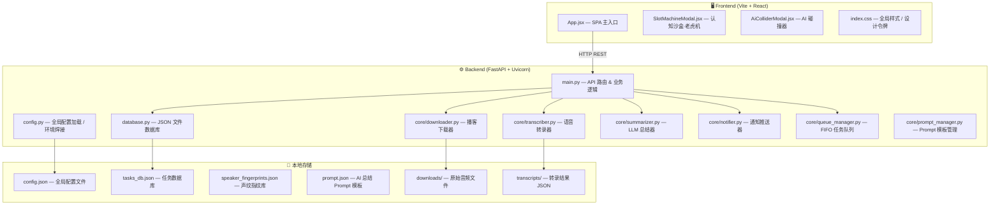
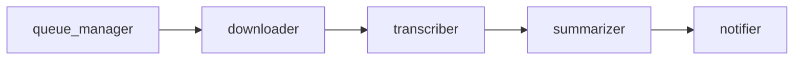
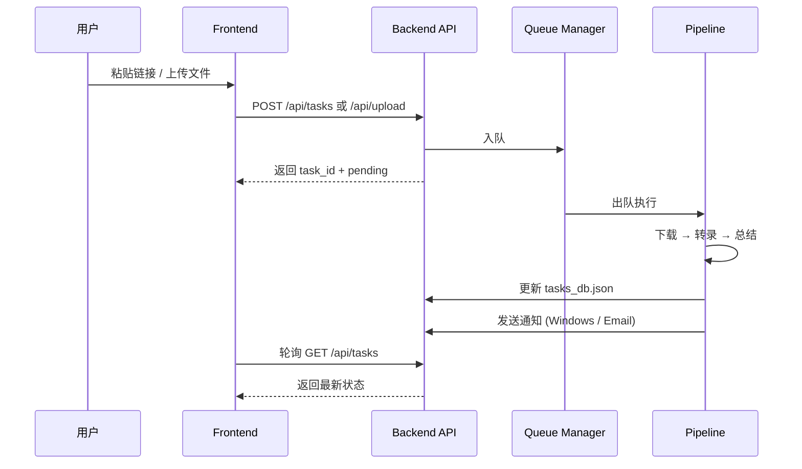
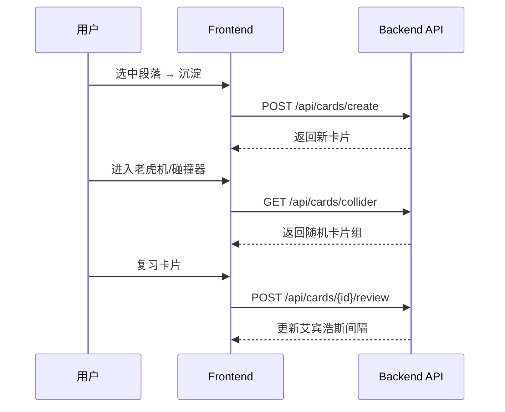

# whisperMe — 系统架构设计文档

> 最后更新：2026-06-16 · Session `4eeb3257`

---

## 1. 总体架构

whisperMe 采用经典的前后端分离 **SPA + REST API** 架构，部署于本地桌面环境（Windows）。



---

## 2. 目录结构

```
whisperMe/
├── README.md                  # 项目首页说明
├── config.json                # 运行时全局配置（由 config.example.json 复制）
├── config.example.json        # 配置模板
├── prompt.json                # AI 总结 Prompt 模板
├── logo.svg                   # 品牌 Logo
├── speaker_fingerprints.json  # 声纹指纹存储
├── tasks_db.json              # 任务持久化数据库
│
├── backend/
│   ├── run.py                 # 后端入口（uvicorn 启动器）
│   ├── requirements.txt       # Python 依赖清单
│   └── app/
│       ├── __init__.py
│       ├── config.py          # 全局配置 & 环境防御层
│       ├── database.py        # JSON 文件数据库 CRUD
│       ├── main.py            # FastAPI 路由 & 业务管道
│       ├── prompt.json        # 内部 Prompt 备份
│       └── core/
│           ├── downloader.py      # 小宇宙 / Bilibili 下载器
│           ├── transcriber.py     # Whisper / MiMo ASR 转录器
│           ├── summarizer.py      # Ollama / 在线 LLM 总结器
│           ├── notifier.py        # 邮件 & Windows 桌面通知
│           ├── queue_manager.py   # FIFO 后台任务队列
│           └── prompt_manager.py  # Prompt 模板 IO
│
├── frontend/
│   ├── package.json
│   ├── vite.config.js
│   └── src/
│       ├── main.jsx           # React 挂载入口
│       ├── App.jsx            # 单文件 SPA 主组件 (~5200 行)
│       ├── App.css            # 辅助样式
│       ├── index.css          # 核心 CSS / 设计令牌
│       ├── SlotMachineModal.jsx   # 认知沙盒 — 老虎机模态
│       └── AiColliderModal.jsx    # AI 碰撞器模态
│
├── downloads/                 # 下载的原始音频
├── transcripts/               # 转录结果 JSON
├── temp_sandbox/              # 临时沙盒目录
├── hf_cache_models/           # HuggingFace 模型缓存
├── models/                    # 本地模型文件
└── docs/                      # 项目文档
```

---

## 3. 后端核心模块

### 3.1 config.py — 全局配置 & 环境防御层

配置模块包含四层"钢铁防御"机制，专门解决 Windows 环境下的兼容性问题：

| 防御层 | 用途 |
|--------|------|
| 🛡️ 层 0 | NumPy 2.0 向后兼容性补焊 (`np.NaN`, `np.float` 等) |
| 🛡️ 层 1 | 强制重写控制台 stdout/stderr 编码为 UTF-8 |
| 🛡️ 层 2 | 提取 venv 中 NVIDIA DLL 路径 (cuBLAS/cuDNN) 并注入 PATH |
| 🛡️ 层 3 | 将 TEMP/TMP/HOME 等环境变量指向本地英文短路径沙盒，规避中文路径报错 |

此外，还包含 **HuggingFace Hub 动态 Patch**：根据是否配置了有效 `hf_token` 自动切换官方源 / 国内镜像站。

### 3.2 main.py — API 路由

| 端点 | 方法 | 功能 |
|------|------|------|
| `/api/tasks` | GET | 获取全部任务列表 |
| `/api/tasks` | POST | 创建新任务（URL 下载） |
| `/api/tasks/{id}` | GET | 获取单任务详情 |
| `/api/tasks/{id}` | DELETE | 删除任务及关联文件 |
| `/api/upload` | POST | 上传本地音频文件 |
| `/api/performance` | GET | 获取实时系统性能指标（CPU/RAM/GPU/VRAM） |
| `/api/tasks/{id}/redownload` | POST | 重新下载任务音频 |
| `/api/tasks/{id}/speaker/rename` | POST | 重命名说话人 |
| `/api/tasks/{id}/summary/regenerate` | POST | 重新生成 AI 总结报告 |
| `/api/tasks/{id}/metadata/refresh` | POST | 刷新任务元数据 |
| `/api/config` | GET/POST | 读取/更新全局配置 |
| `/api/prompt` | GET/POST | 读取/更新 Prompt 模板 |
| `/api/paragraphs` | GET | 获取段落列表（认知沙盒用） |
| `/api/cards/create` | POST | 创建 Anki 闪光卡片 |
| `/api/cards` | GET | 获取全部卡片 |
| `/api/cards/due` | GET | 获取到期待复习卡片 |
| `/api/cards/{id}/review` | POST | 提交卡片复习结果 |
| `/api/cards/collider` | GET | AI 碰撞器·随机抽取卡片 |
| `/api/links` | GET/POST | 知识链接管理 |
| `/audio/{file}` | Static | 静态文件挂载，提供音频播放 |

### 3.3 core/ — 核心处理管道

播客处理遵循一条 **FIFO 异步管道**：



- **downloader.py**：支持小宇宙 FM 和 Bilibili 两个源，使用 `httpx` + `yt-dlp` + `FFmpeg` 进行音频提取
- **transcriber.py**：双模式转录 — 本地 `faster-whisper` (GPU/CPU) / 在线 `MiMo ASR` API；集成 `pyannote.audio` 进行声纹分段与说话人识别
- **summarizer.py**：双模式总结 — 本地 `Ollama/LM Studio` / 在线 `OpenAI 兼容 API`
- **notifier.py**：支持 Windows 桌面气泡推送和 SMTP 邮件通知（可独立开关）
- **queue_manager.py**：FIFO 后台任务排队，显存不足时自动降级至 CPU

### 3.4 database.py — 数据持久化

使用 JSON 文件 (`tasks_db.json`) 作为轻量数据库，无需外部数据库服务。支持：
- 任务 CRUD
- Anki 闪光卡片存储与复习记录
- 知识链接关系管理
- 线程安全的读写锁

---

## 4. 前端架构

### 4.1 技术栈

- **Vite** — 构建工具
- **React 18** — UI 框架
- **Vanilla CSS** — 全局样式，使用 CSS Custom Properties (设计令牌)
- **无第三方 UI 库** — 所有组件均为自研

### 4.2 页面结构

| 页面/Tab | 功能 |
|----------|------|
| 播客库 (Dashboard) | 任务列表、状态监控、新增任务 |
| 任务详情 (Detail) | 剧本对话流、AI 总结报告、Shownotes、说话人管理 |
| 认知沙盒 (Sandbox) | 段落沉淀、Anki 闪光卡片、老虎机、AI 碰撞器 |
| 系统设置 (Settings) | 外观主题、ASR/LLM 引擎配置、SMTP 通知配置 |

### 4.3 国际化 (i18n)

内置四语言支持，通过 `TRANSLATIONS` 常量对象实现前端 i18n：
- 🇨🇳 简体中文 (`zh-CN`) — 默认
- 🇹🇼 繁體中文 (`zh-TW`)
- 🇺🇸 English (`en-US`)
- 🇯🇵 日本語 (`ja-JP`)

### 4.4 主题系统

支持 **浅色 / 深色 / 跟随系统** 三种显示模式，每种模式内置多套预设配色方案（如 Antigravity Slate、Midnight Obsidian 等），并支持自定义背景色/前景色/强调色。

### 4.5 设计令牌 (Design Tokens)

所有样式通过 CSS Custom Properties 统一管理（见 `index.css :root`），包括：
- 字体：Outfit + Noto Sans SC
- 色彩：HSL 调和配色系统
- 圆角：`--radius-sm` (8px) / `--radius-md` (14px) / `--radius-lg` (24px)
- 过渡：`--transition-smooth` (cubic-bezier)

---

## 5. 数据流

### 5.1 新建任务流程



### 5.2 认知沙盒流程



---

## 6. 关键设计决策

| 决策 | 理由 |
|------|------|
| JSON 文件数据库 | 轻量部署，无需 SQLite/PostgreSQL，适合个人本地使用 |
| 8.3 短路径转换 | 规避 Windows 中文用户名导致的 C++ 底层库路径报错 |
| HuggingFace 镜像自动切换 | 国内用户无需配置代理即可下载 PyAnnote 模型 |
| 显存熔断降级 | GPU 内存不足时自动切换至 CPU 模式，避免 OOM 崩溃 |
| 单文件 SPA (App.jsx) | 减少组件间通信复杂度，适合快速迭代的个人项目 |
| FIFO 任务队列 | 避免多任务并发时显存竞争，保证稳定性 |
| 双模式 ASR/LLM | 支持纯离线和云端 API 两种模式，灵活适配不同场景 |

---

## 7. 运行时端口

| 服务 | 端口 | 说明 |
|------|------|------|
| Frontend (Vite) | 5173 | 开发服务器 |
| Backend (FastAPI) | 8000 | API 服务 + 静态音频挂载 |
| Ollama / LM Studio | 11434 | 本地 LLM 推理（可选） |
